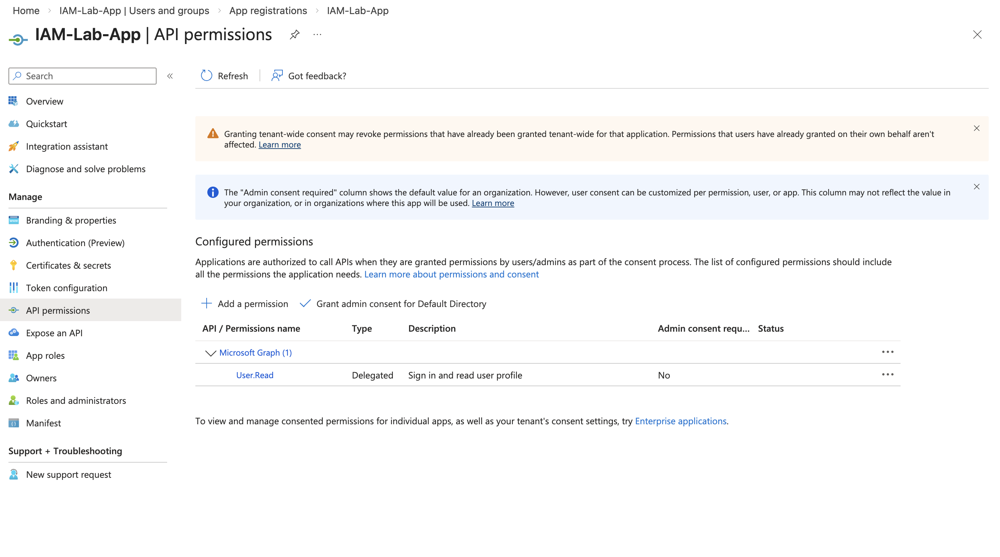
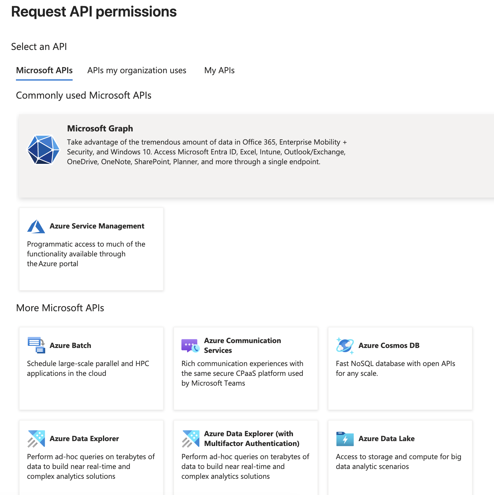
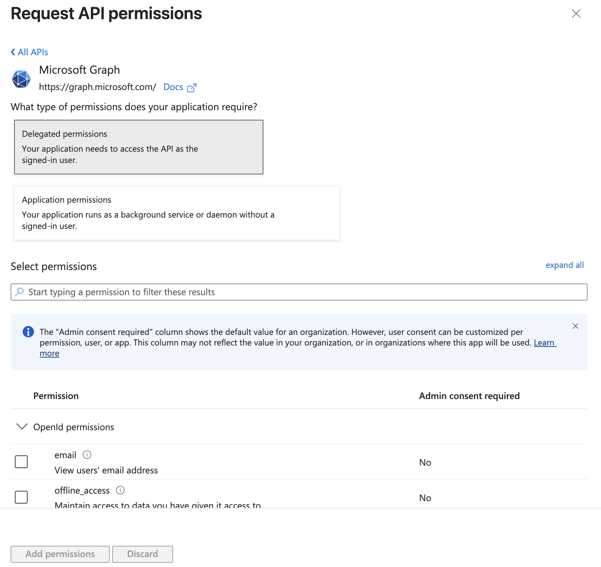
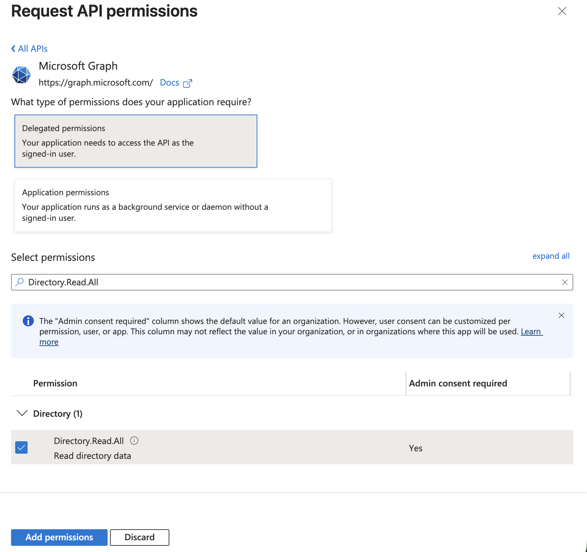
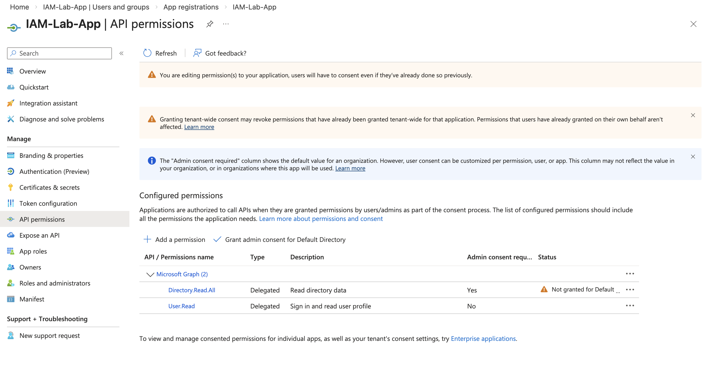

# Lab 8 — Microsoft Graph API Permissions Configuration

## Objective

Demonstrate how to configure Microsoft Graph API permissions for an application in Microsoft Entra ID.

This lab simulates real-world IAM Engineer tasks involving:

- Application authorization
- Identity directory access configuration
- Microsoft Graph integration
- Delegated permission assignment

---

## Overview

API permissions allow applications to securely access identity data in Microsoft Entra ID through Microsoft Graph.

These permissions control what an application can read or modify within the identity directory.

This is commonly used for:

- IAM automation
- Identity governance tools
- Enterprise applications
- Authentication integrations
- Cloud security tools

---

## Step 1 — Open API Permissions

Navigated to:

Microsoft Entra ID  
→ App registrations  
→ IAM-Lab-App  
→ API permissions  

Verified existing permissions configuration.

Screenshot:

---

## Step 2 — Add Microsoft Graph Permission

Clicked:

Add a permission  
→ Microsoft Graph  

This allows the application to access identity resources.

Screenshot:

---

## Step 3 — Select Delegated Permissions

Selected:

Delegated permissions

Delegated permissions allow the application to access resources on behalf of the signed-in user.

Screenshot:

---

## Step 4 — Select Directory.Read.All Permission

Selected permission:

Directory.Read.All

This permission allows the application to read directory data, including:

- Users
- Groups
- Roles
- Identity objects

This is commonly required in IAM and identity monitoring systems.

Screenshot:

---

## Step 5 — Add Permission to Application

Clicked:

Add permissions

Permission successfully added to the application.

Screenshot:

---

## Step 6 — Verify Configured Permissions

Verified application now has:

- User.Read
- Directory.Read.All

This confirms the application can access identity directory data.

Screenshot:

---

## Permission Types Explained

### Delegated Permissions

Used when:

- A user is signed in
- Application acts on behalf of the user

### Application Permissions

Used when:

- No user is signed in
- Application runs as a background service

This lab used Delegated Permissions.

---

## Security Importance

API permissions must be carefully controlled because they allow applications to access identity data.

Proper configuration helps prevent:

- Unauthorized identity access
- Privilege escalation
- Identity data exposure

This is a critical IAM responsibility.

---

## Skills Demonstrated

Identity and Access Management:

- Microsoft Entra ID Application Management
- Microsoft Graph API Integration
- API Permission Configuration
- Directory Access Control

Cloud Security:

- OAuth permission model
- Delegated access configuration
- Identity platform security

IAM Engineering:

- Application authorization
- Identity integration configuration
- Enterprise identity access control

---

## Tools Used

- Microsoft Entra ID
- Microsoft Graph API
- Azure Portal
- GitHub

---

## Folder Structure
