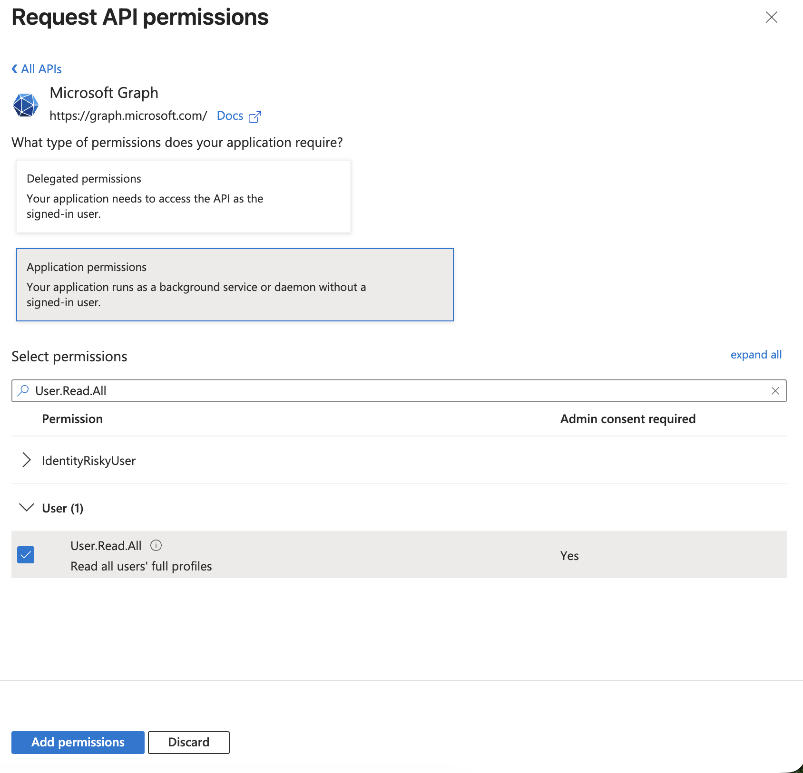
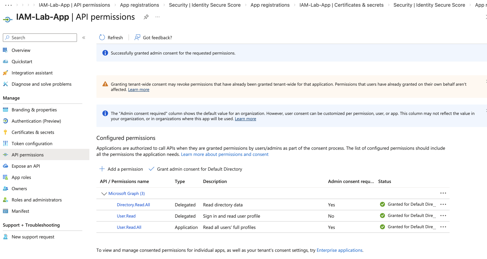
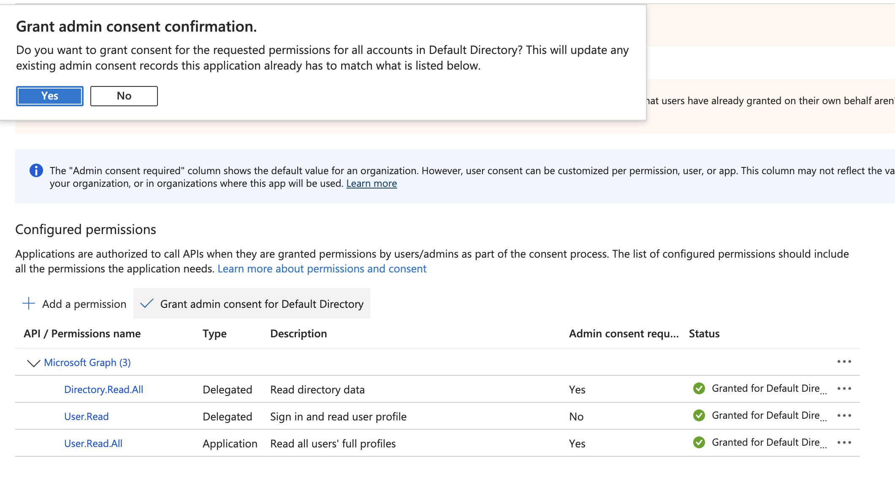

# Lab 8 — Microsoft Graph API Application Permissions (Application Permission & Admin Consent)

## Objective

Demonstrate how to configure **Application permissions** in Microsoft Entra ID and grant **admin consent**, allowing an application (service principal) to access directory data without a signed-in user.

This simulates real-world IAM scenarios such as automation, background services, and identity integrations.

---

## What this Lab Demonstrates

- Application permissions vs Delegated permissions
- Microsoft Graph API authorization model
- Service Principal privilege assignment
- Admin consent workflow
- OAuth-based application identity access

---

## Step 1 — Add Application Permission

Navigated to:

Microsoft Entra Admin Center → App registrations → IAM-Lab-App → API permissions → Add a permission

Selected:

- Microsoft Graph
- Application permissions
- Permission: **User.Read.All**

This permission allows the application to read all user profiles in the directory.

Screenshot:

---

## Step 2 — Grant Admin Consent

Granted tenant-wide admin consent to allow the application to use the permission without user interaction.

This step is required for Application permissions.

Screenshot:

---

## Step 3 — Verify Permission Successfully Granted

Verified the following permissions were successfully configured:

- Directory.Read.All (Delegated)
- User.Read (Delegated)
- User.Read.All (Application)

All permissions show:

Status: Granted for Default Directory

Screenshot:

---

## Key IAM Concepts Demonstrated

Application permissions allow apps to run as service identities without user interaction.

This is used for:

- Automation scripts
- Identity synchronization
- Background services
- Cloud integrations
- Enterprise applications

---

## Security Importance

Application permissions are highly privileged and must be carefully controlled.

Improper configuration can allow applications to read or modify directory data.

This lab demonstrates proper configuration and authorization workflow.

---

## Skills Demonstrated

- Microsoft Entra ID App Registration management
- Microsoft Graph API permission configuration
- Application identity authorization
- Admin consent workflow
- Service Principal privilege management
- OAuth application access model

---

## Folder Structure
