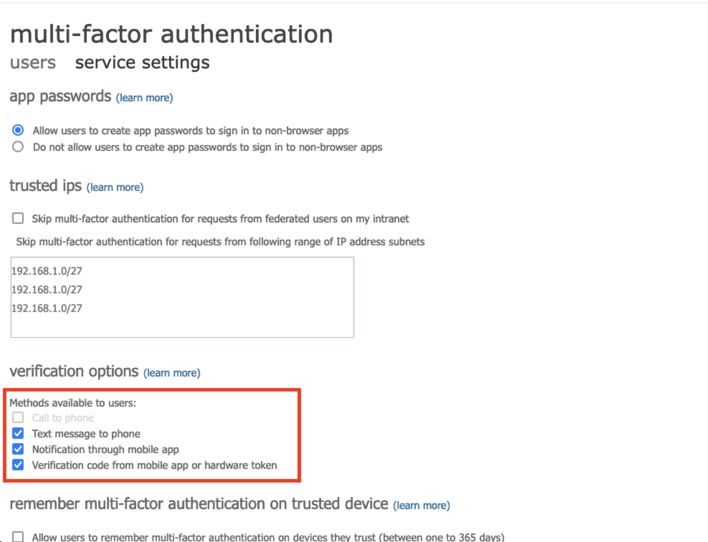
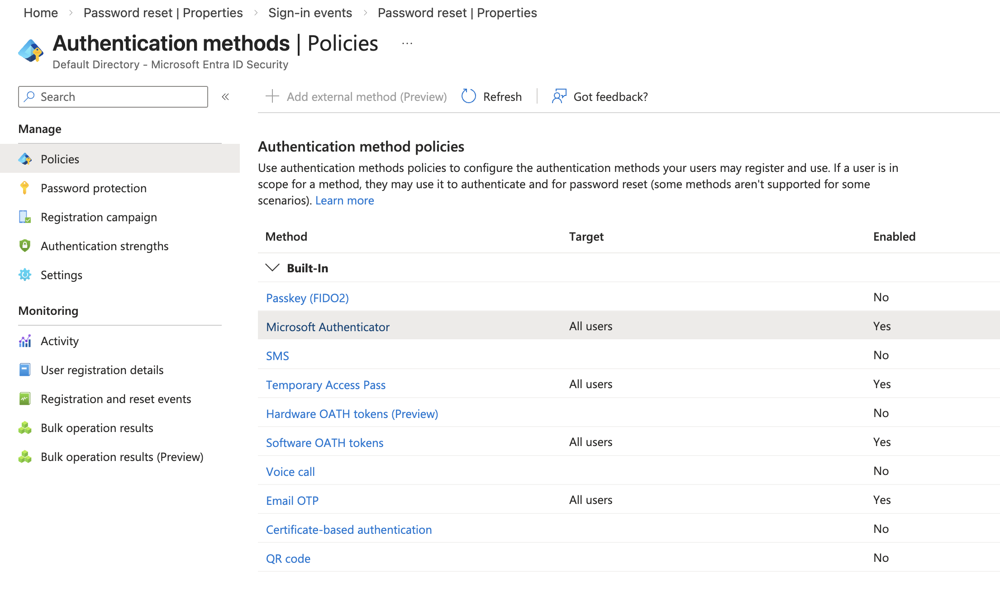
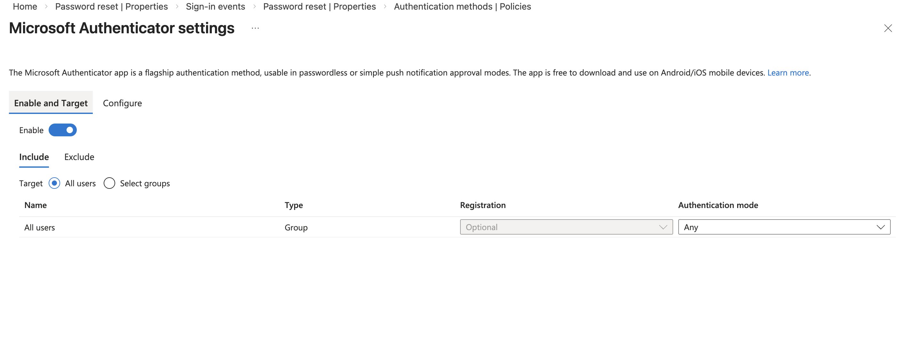

# Entra ID Lab – Authentication Methods Configuration

## Objective

Configure and verify authentication methods in Microsoft Entra ID to support Multi-Factor Authentication (MFA) and strengthen tenant identity security.

This lab demonstrates how administrators control which authentication methods users can register and use.

---

## Actions Performed

- Navigated to Microsoft Entra Admin Center
- Accessed Authentication Methods Policies
- Reviewed available authentication methods
- Verified Microsoft Authenticator is enabled
- Confirmed target scope set to All users
- Validated authentication methods configuration

---

## Screenshots

### Authentication Methods Policy Configuration
Shows available authentication methods and enabled status.

---

### Authentication Methods Policies Overview
Shows Microsoft Authenticator and other authentication methods enabled.

---

### Microsoft Authenticator Enabled
Shows Microsoft Authenticator enabled and targeted to all users.

---

## Result

Authentication methods successfully configured in Microsoft Entra ID.

Users can now register Microsoft Authenticator and use it for secure Multi-Factor Authentication.

---

## Skills Demonstrated

- Authentication methods configuration
- MFA infrastructure setup
- Identity security configuration
- Microsoft Entra ID security administration
- Identity and access hardening
