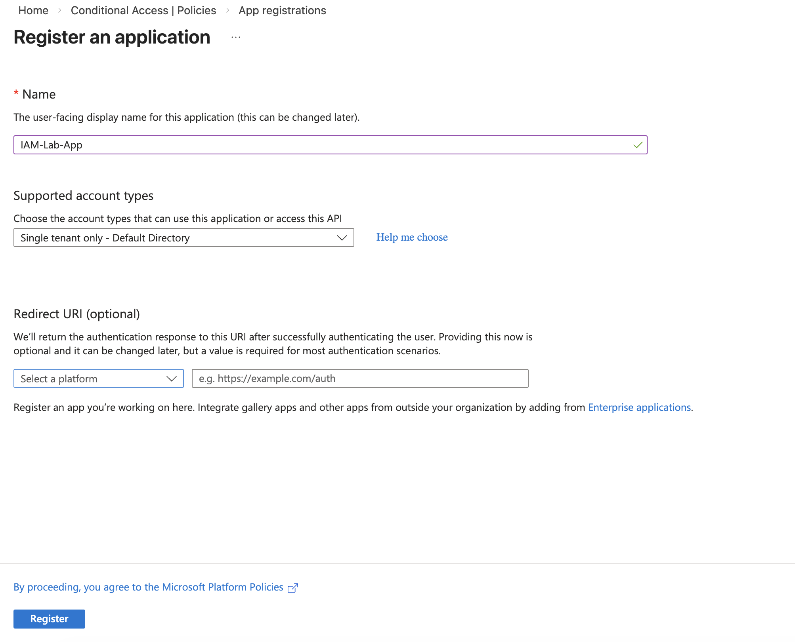
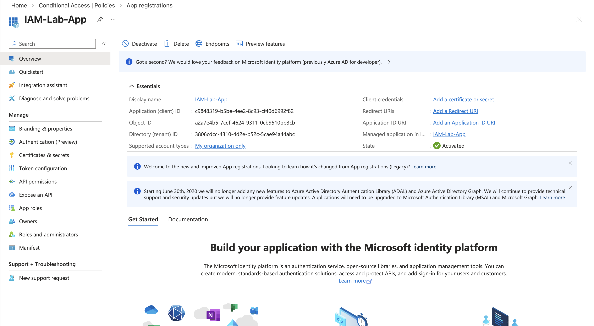
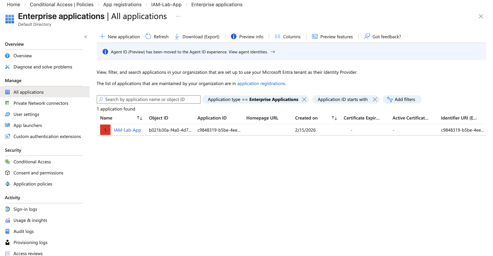
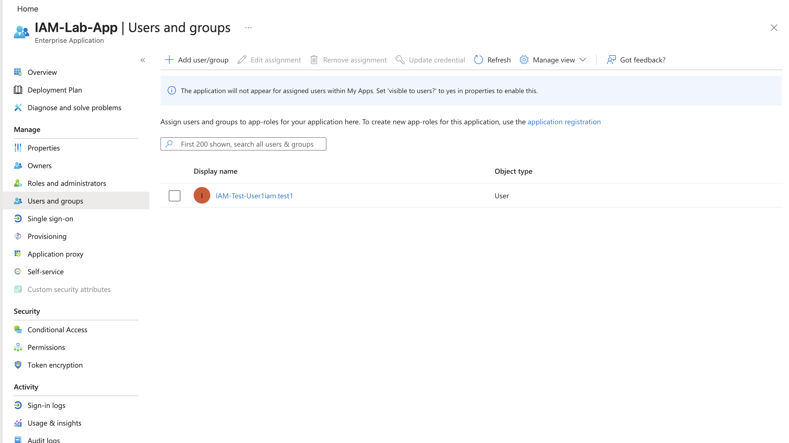

# Lab 7 — Enterprise Application Registration (App Registration & Service Principal)

---

## Objective

Demonstrate how to register an application in Microsoft Entra ID and verify the associated Enterprise Application (Service Principal) used for authentication, access control, and IAM integrations.

This simulates real-world IAM tasks such as:

- Application identity creation
- Service principal management
- OAuth identity configuration
- Enterprise application access assignment

---

## Step 1 — Register Application

Created a new application registration in Microsoft Entra ID.

Configuration:

- Name: IAM-Lab-App  
- Supported account types: Single tenant (Default Directory)

Screenshot:

---

## Step 2 — Verify Application Registration

Verified application identity was successfully created.

Verified:

- Application (Client) ID
- Object ID
- Tenant ID
- Application status: Active

Screenshot:

---

## Step 3 — Verify Enterprise Application (Service Principal)

Confirmed Microsoft Entra automatically created an Enterprise Application (Service Principal).

This service principal represents the application identity inside the tenant.

Verified:

- Enterprise application exists
- Application name matches registration
- Object ID assigned
- Application available for access assignment

Screenshot:

---

## Step 4 — Assign User to Enterprise Application

Assigned user access to the Enterprise Application.

Assigned user:

- IAM-Test-User1iam.test1

Role assigned:

- Default Access

This simulates granting application access to users in enterprise environments.

Screenshot:

---

## What was created automatically

When registering the application, Microsoft Entra created two identities:

| Identity Type | Purpose |
|--------------|---------|
| App Registration | Defines the application identity configuration |
| Enterprise Application (Service Principal) | Represents the application inside the tenant for authentication and access control |

---

## Skills Demonstrated

- Application Registration
- Service Principal Management
- Enterprise Application Configuration
- Identity Access Assignment
- IAM Application Integration
- OAuth Application Identity Setup
- Microsoft Entra ID Identity Architecture

---

## IAM Real-World Relevance

This lab simulates real IAM engineer tasks such as:

- Integrating applications with Microsoft Entra ID
- Managing service principals
- Assigning users to applications
- Configuring identity-based authentication
- Preparing applications for SSO, automation, and API access

---

## Folder Structure
