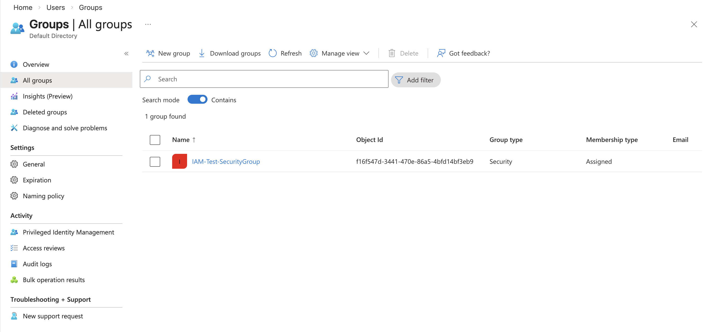
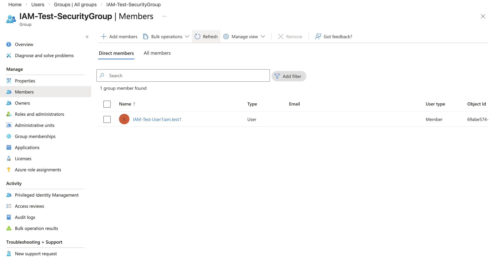

# Entra ID Lab – Security Group Management

## Objective
Demonstrate IAM access control using Security Groups in Microsoft Entra ID.

## Actions Performed
- Created Security Group
- Configured group type as Assigned
- Added user as member
- Verified membership assignment

## Skills Demonstrated
- Role-based access control (RBAC)
- Security group configuration
- Identity access management
- Access provisioning

## Tools Used
- Microsoft Entra ID
- Microsoft Entra Admin Center

## Screenshots

### Security Group Creation

### Adding Member to Group

### Group Overview with Member

