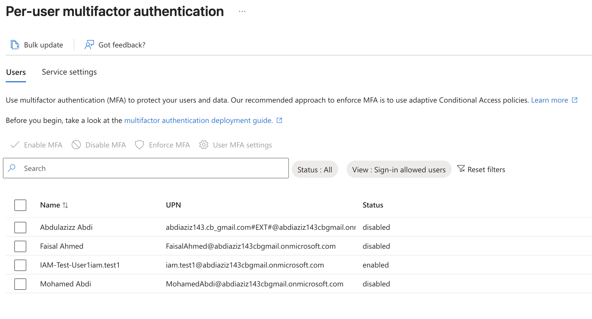
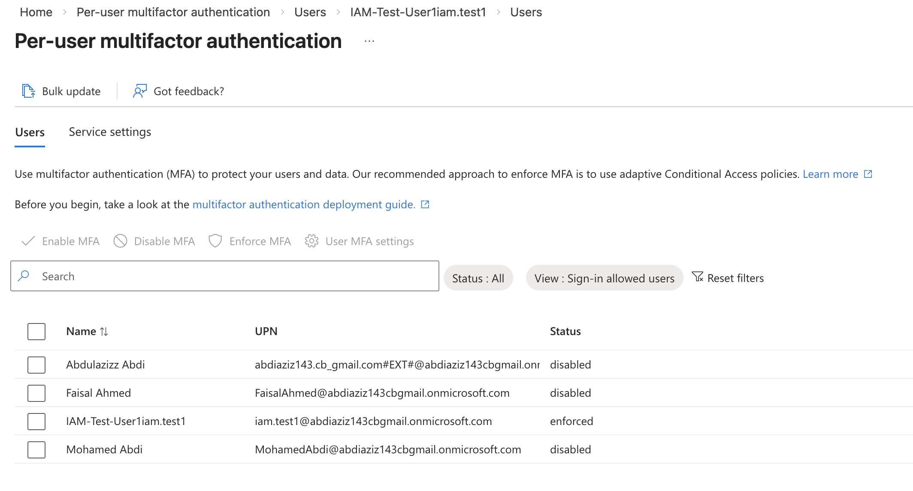

# Entra ID Lab – Multi-Factor Authentication (MFA)

## Objective

Demonstrate identity protection by enabling and enforcing Multi-Factor Authentication (MFA) for a user in Microsoft Entra ID.

---

## Actions Performed

- Reset test user password
- Enabled per-user MFA
- Enforced MFA registration
- Verified MFA status as Enforced

---

## Skills Demonstrated

- Identity Security Hardening
- Multi-Factor Authentication Configuration
- Microsoft Entra ID Administration
- Authentication Policy Enforcement

---

## Tools Used

- Microsoft Entra ID Admin Center
- Per-User MFA Configuration
- Password Reset Workflow

---

## MFA Configuration Screenshots

### Password Reset Confirmation

### MFA Enabled

### MFA Status Enforced

