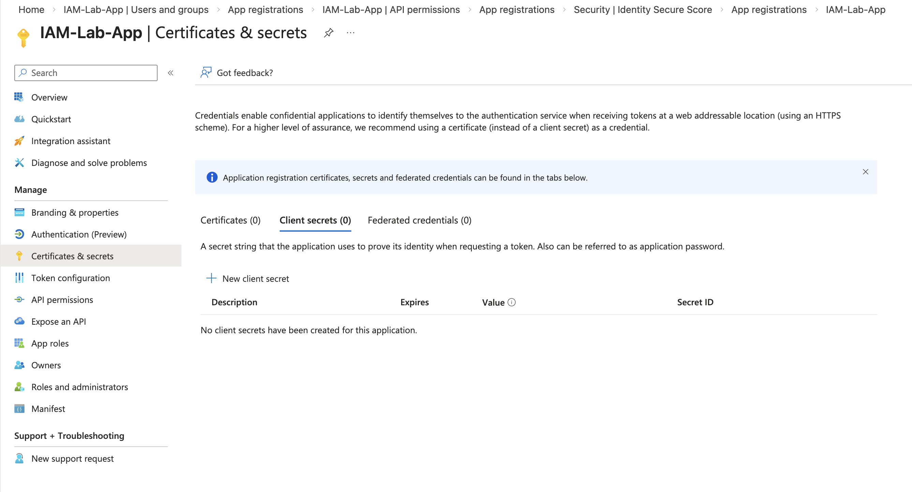
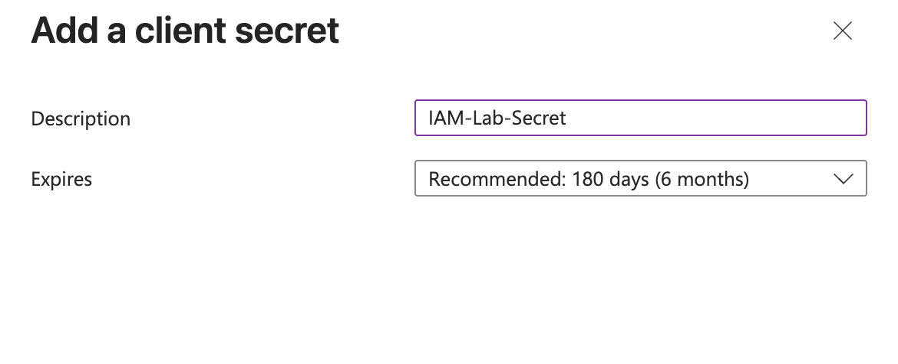
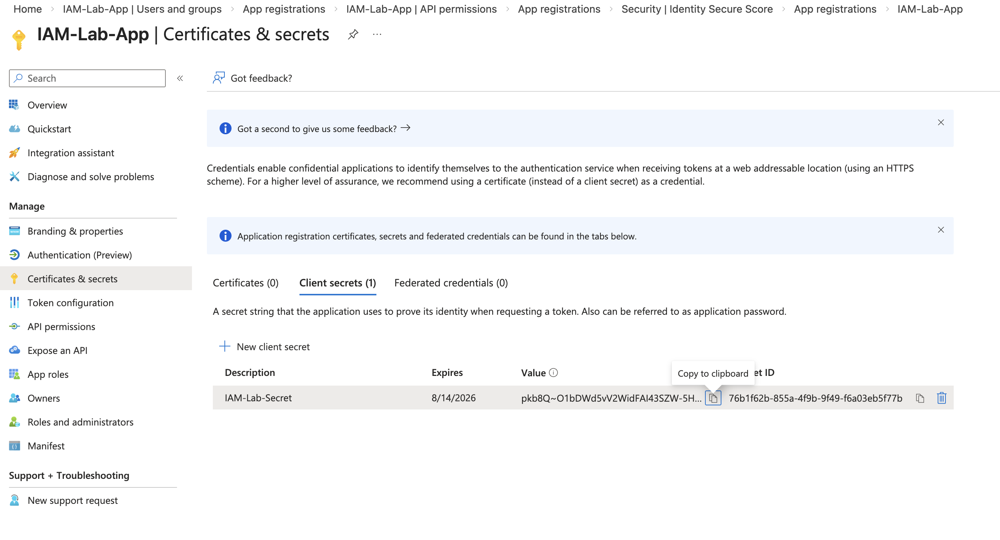

# Lab 9 — Service Principal Secret Configuration

## Objective

Create a client secret for an enterprise application to enable secure authentication using a Service Principal.

This simulates real-world IAM scenarios where applications authenticate securely to Microsoft Entra ID.

---

## Overview

Service Principals represent applications in Microsoft Entra ID.

Client secrets act as application passwords used for secure authentication.

This is commonly used for:

- Automation scripts
- Cloud integrations
- Enterprise applications
- Microsoft Graph API access
- Identity automation

---

## Step 1 — Navigate to Certificates & Secrets

Location:

Microsoft Entra ID  
→ Applications  
→ App registrations  
→ IAM-Lab-App  
→ Certificates & secrets  

Screenshot:

---

## Step 2 — Create New Client Secret

Configured:

Description:
IAM-Lab-Secret

Expiration:
6 months

Screenshot:

---

## Step 3 — Secret Created Successfully

Client secret was generated and assigned to the Service Principal.

This secret allows secure authentication for applications.

Screenshot:

---

## Security Importance

Client secrets allow applications to authenticate securely without user interaction.

Proper secret management is critical for:

- Secure automation
- Preventing unauthorized access
- Protecting application identity

---

## Skills Demonstrated

- Service Principal Management
- Application Identity Security
- Microsoft Entra ID Administration
- Secure Application Authentication
- Identity and Access Management (IAM)

---

## Tools Used

- Microsoft Entra ID
- Azure Portal
- GitHub

---

## Outcome

Successfully created and configured a Service Principal client secret, enabling secure application authentication.

This is a core IAM Engineer and Cloud Identity skill used in enterprise environments.
