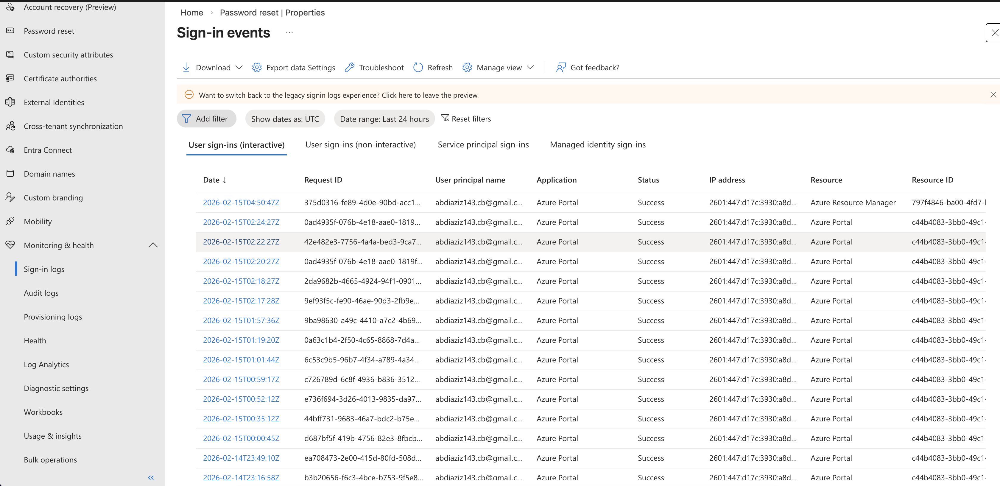
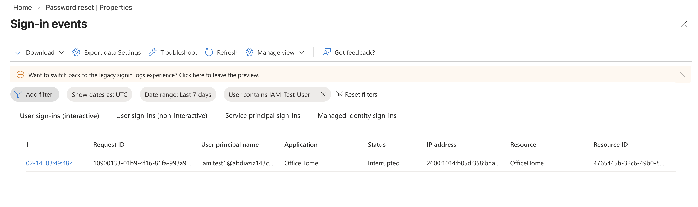
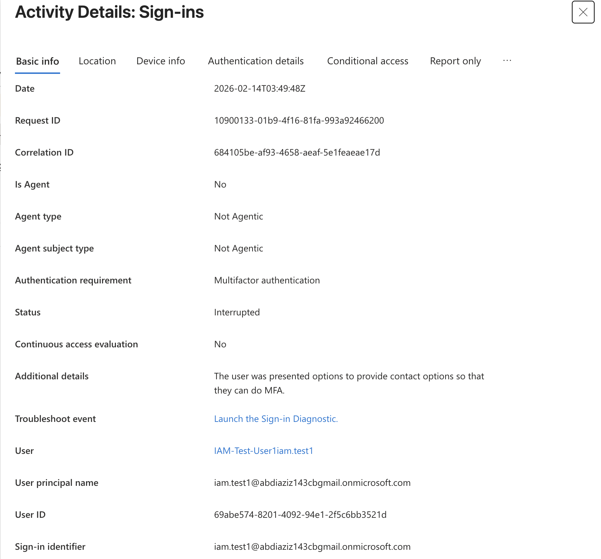

# Entra ID Lab – Sign-In Log Monitoring

## Objective

Demonstrate identity monitoring and security auditing using Microsoft Entra ID Sign-In Logs.

## Actions Performed

• Accessed Microsoft Entra ID Sign-In Logs  
• Filtered sign-in logs for specific user account  
• Reviewed authentication details including IP address and application  
• Verified successful login events  
• Examined authentication and security information  

## Skills Demonstrated

• Identity monitoring  
• Authentication auditing  
• Security event analysis  
• Microsoft Entra ID administration  
• IAM security operations  

## Tools Used

• Microsoft Entra ID  
• Azure Portal  

## Sign-In Log Screenshots

### Sign-In Logs Overview

### User-Filtered Sign-In Logs

### Sign-In Details

