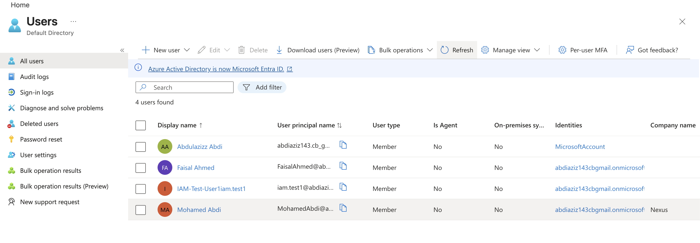

# Entra ID Lab – User Management

## Objective
Demonstrate IAM user lifecycle management in Microsoft Entra ID.

## Actions Performed
- Created new cloud user
- Configured auto-generated password
- Verified user in directory
- Enabled account status

## Skills Demonstrated
- Identity lifecycle management
- Cloud user provisioning
- Entra ID administration
- Basic IAM operations

## Tools Used
- Microsoft Entra ID (Azure AD)
- Microsoft Entra Admin Center

## Screenshots

### User Creation Form

### Review + Create Page

### User Appearing in Directory

